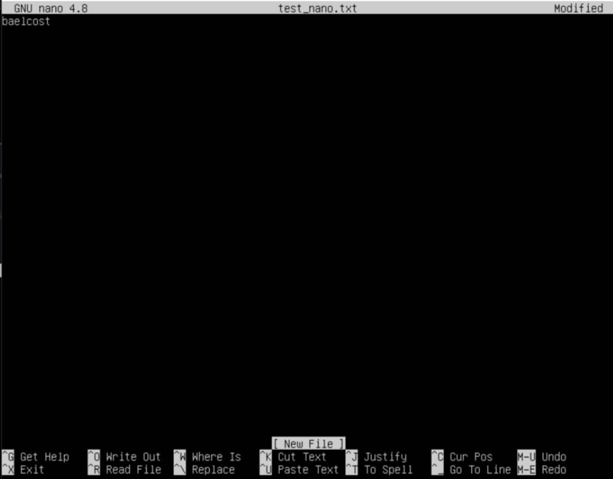
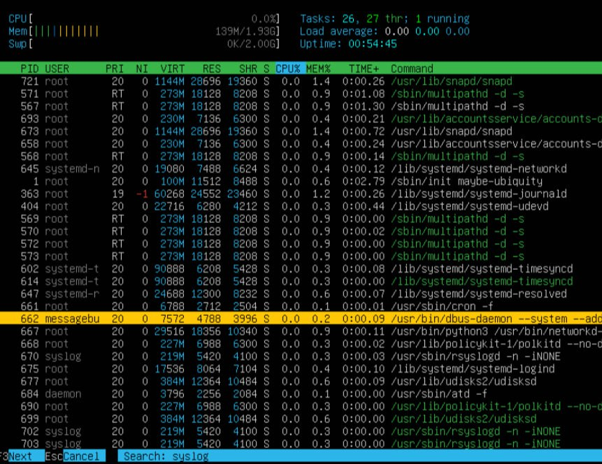
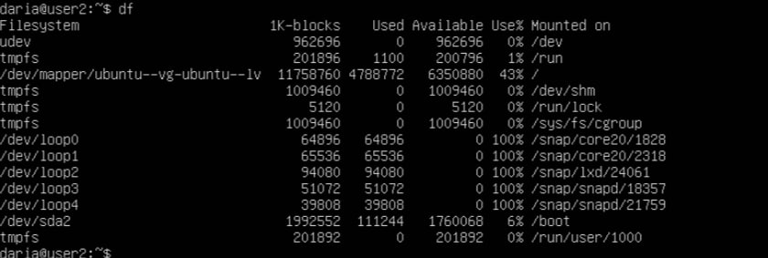
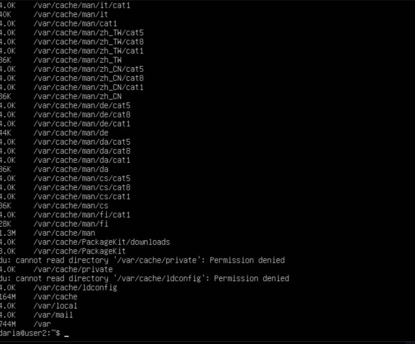

## Содержание ##
1. [Part 1. Установка ОС](#part-1-установка-ос)
2. [Part 2. Создание пользователя](#part-2-создание-пользователя)
3. [Part 3. Настройка сети ОС](#part-3-настройка-сети-ос)
4. [Part 4. Обновление ОС](#part-4-обновление-ос)
5. [Part 5. Использование команды sudo](#part-5-использование-команды-sudo)
6. [Part 6. Установка и настройка службы времени](#part-6-установка-и-настройка-службы-времени)
7. [Part 7. Установка и использование текстовых редакторов](#part-7-установка-и-использование-текстовых-редакторов)
8. [Part 8. Установка и базовая настройка сервиса SSHD](#part-8-установка-и-базовая-настройка-сервиса-sshd)
9. [Part 9. Установка и использование утилит top, htop](#part-9-установка-и-использование-утилит-top-htop)
10. [Part 10. Использование утилиты fdisk](#part-10-использование-утилиты-fdisk)
11. [Part 11. Использование утилиты df](#part-11-использование-утилиты-df)
12. [Part 12. Использование утилиты du](#part-12-использование-утилиты-du)
13. [Part 13. Установка и использование утилиты ncdu](#part-13-установка-и-использование-утилиты-ncdu)
14. [Part 14. Работа с системными журналами](#part-14-работа-с-системными-журналами)
15. [Part 15. Использование планировщика заданий CRON](#part-15-использование-планировщика-заданий-cron)

 

## Part 1. Установка ОС ##
**Установливаем Ubuntu 20.04 Server LTS без графического интерфейса. (Используя программу для виртуализации - VirtualBox). Проверяем версию с помощью команды `cat /etc/issue`**

 *Рис.1 проверяем версию* 

 

## Part 2. Создание пользователя ##
**1. Создаем пользователя**

 *Рис.2 создаем пользователя, добавляем в группу adm* 

**2. Проверяем, что новый пользователь есть в выводе команды `cat /etc/passwd`**

 *Рис.3 использование команды `cat /etc/passwd`* 

 

## Part 3. Настройка сети ОС ##
**1. Задаем название машины вида user-1**

 *Рис.4 задаем название машины* 

**2. Устанавливаем временную зону, соответствующую моему текущему местоположению (Новосибирск).**

 *Рис.5 устанавливаем временную зону* 

**3. Выведем названия сетевых интерфейсов с помощью консольной команды**

 *Рис.6 названия сетевых интерфейсов* 

* Интерфейс lo (от loopback, что переводится как "обратная петля") - виртуальный сетевой интерфейс, имеющей IP-адрес 127.0.0.1. Она предназначена для обеспечения сетевого доступа к компьютеру. Также имеет dns-имя - localhost.

**4. Используя консольную команду, получаем ip адрес устройства, на котором работаем, от DHCP сервера**

 *Рис.7 получаем ip адрес моего устройства* 

* DHCP (англ. Dynamic Host Configuration Protocol — протокол динамической настройки узла) — сетевой протокол, позволяющий сетевым устройствам автоматически получать IP-адрес и другие параметры, необходимые для работы в сети TCP/IP. Данный протокол работает по модели «клиент-сервер».

**5. Определили и вывели на экран внешний ip-адрес шлюза (ip) и внутренний IP-адрес шлюза, он же ip-адрес по умолчанию (gw)**

 *Рис.8 внешний ip адрес* 
 *Рис.9 внутренний ip адрес* 

**6. Задаем статичные (заданные вручную, а не полученные от DHCP сервера) настройки ip, gw, dns (используя публичный DNS серверы, например 1.1.1.1 или 8.8.8.8) с помощью команды `sudo vim /etc/netplan/00-installer-config.yaml`**

 *Рис.10 задаем статичные настройки ip, gw, dns* 
 *Рис.11 сохраняем изменения* 

**7. Перезагружаем виртуальную машину. Убеждаемся, что статичные сетевые настройки (ip, gw, dns) соответствуют заданным в предыдущем пункте**

 *Рис.12 перезагружаем машину* 
 *Рис.13 после перезапуска данные совпадают с предыдущими* 

**8. Пропинговали удаленные хосты 1.1.1.1 и ya.ru. В выводе команды есть фраза «0% packet loss»**

 *Рис.14 хост 1.1.1.1* 
 *Рис.15 хост ya.ru* 

 

## Part 4. Обновление ОС ##

**Обновляем системные пакеты до последней на момент выполнения задания версии**

 *Рис.16 Обновляем системные пакеты* 

 

## Part 5. Использование команды sudo ##

**Разрешаем пользователю, созданному в Part 2,выполнять команду sudo.**

Использование команды для создания пароля user2 `sudo passwd user2`
Использование команды `sudo usermod -aG sudo user` для наделения user2 правами суперпользователя

 *Рис.17 Разрешаем пользователю выполнять команду sudo* 

* sudo (Superuser Do) - это команда, которая позволяет пользователю выполнить команду от имени другого пользователя, обычно с правами администратора (root)

 

## Part 6. Установка и настройка службы времени ##

**Настроем службу автоматической синхронизации времени**

 *Рис.18 Настраиваем службу автоматической синхронизации времени* 

 

## Part 7. Установка и использование текстовых редакторов ##

**1. Используя каждый из трех выбранных редакторов, создаем файл test_X.txt, где X -- название редактора, в котором создан файл. Пишем в нём свой никнейм, закрываем файл с сохранением изменений**

 *Рис.19 Для выхода используется Esc, затем пишется :wq и название файла* 

 *Рис.20 Для сохранения и выхода из файла для начала прожимаем ^O - сохранение файла, после чего подтверждаем и прожимаем для выхода ^X* 

 *Рис.21 сохраняется с помощь ^KX* 

**2. Используя каждый из трех выбранных редакторов, открываем файл на редактирование, редактируем файл, заменив никнейм на строку «21 School 21», закрой файл без сохранения изменений**

 *Рис.22 сохраняем без изменений с помощью :q!* 

 *Рис.23 сохраняем без изменений с помощью ^X N* 

 *Рис.24 сохраняем без изменений с помощью ^C Y* 

**3. Используя каждый из трех выбранных редакторов, редактируем файл ещё раз (по аналогии с предыдущим пунктом), а затем ищем по содержимому файла (слово) и замены слова на любое другое**

 *Рис.25 ищем слово с помощью /'слово'* 
 *Рис.26 меняем с помощью :s/изначальное слово/замененное слово'* 

 *Рис.27 поиск по ^W* 
 *Рис.28 заменяем слово* 
 *Рис.29 сохраняем на Y* 

 *Рис.30 для поиска используем ^K F > что ищем > I* 
 *Рис.31 для замены используем ^K F > что собираемся заменить > R > чем заменяем > Y* 

 

## Part 8. Установка и базовая настройка сервиса SSHD ##

**1. Установим службу SSHd**

 *Рис.32 устанавливаем службу SSHd* 

**2. Добавляем автостарт службы при загрузке системы**

 *Рис.33 добавляем автостарт* 

**3. Перенастраиваем службу SSHd на порт 2022 с помощью команды `sudo nano /etc/ssh/sshd_config` меняем 22 на 2022**

 *Рис.34 перенастраиваем службу SSHd на порт 2022* 

 *Рис.35 добавляем автозапуск через команду `sudo systemctl enable ssh`* 

**4. Используем команду ps, чтобы увидеть наличие процесса sshd**

 *Рис.36 используя команду ps, покажи наличие процесса sshd. Для этого к команде нужно подобрать ключи* 
* ps - сведения о процессах
* -е - все процессы

**5. `sudo reboot` - перезапускает систему**

**6. Вывод команды `netstat -tan` содержит `tcp 0 0 0.0.0.0:2022 0.0.0.0:* LISTEN`** 

 *Рис.37 вывод команды `netstat -tan`* 
* -a - Отображает состояние сокетов (сокеты используемые серверными процессами обычно не отображаются)

* -n - Отображает сетевые адреса как числа, а не как символы

* -t - Отображает TCP подключения

* Proto - Тип протокола

* Recv-Q - Счетчик байтов не скопированных программой пользователя из этого сокета

* Send-Q - Счетик байтов, которые не подтверждены удаленнеым узлом

* Local Address - Адрес и номер порта локального конца сокета

* Foreign Address - Адрес и номер порта удаленного конца сокета

* State - Состояние сокета

* LISTEN - Ожидание входящих подключений

* 0.0.0.0 - немаршрутизируемый адрес IPv4, который используется в качестве адреса по умолчанию или адреса-заполнителя

 

## Part 9. Установка и использование утилит top, htop ##

**Установим и запустим утилиты top и htop**

**выводы команды top**
 *Рис.38 top* 
* uptime - 16 минут;
* количество авторизованных пользователей - 1;
* общая загрузка системы - 0.00 0.00 0.00;
* общее количество процессов - 99;
* загрузку cpu - процент времени процессора, затраченного на выполнение пользовательских процессов (us) 0.0
процент времени процессора, затраченного на выполнение процессов ядра (sy) 0.0
процент времени процессора, затраченного на выполнение пользовательских процессов с ограничениями (ni) 0.0
процент времени процессора проведённое в режиме ожидания (id) 99.7
процент времени процессора потраченное на ожидание на периферийных устройствах (wa) 0.0
* загрузку памяти - физическая память (Mem)
общий объем ОЗУ (total) 1971.6
количество свободной памяти (free) 1471.5
количество занятой памяти (used) 138.7
зарезервированная системой память (buff/cache) 361.4
виртуальная память или пространство подкачки (Swap)
общий объем ОЗУ (total) 2048.0
количество свободной памяти (free) 2048.0
количество занятой памяти (used) 0.0
память который может быть выделена для процессов, не использую \ большую область диска (avail Mem) 1678.9
* pid процесса занимающего больше всего памяти - 673
* pid процесса, занимающего больше всего процессорного времени - 1659

**выводы команды htop**
 *Рис.39 htop* 
* отсортировано по PID
 *Рис.40 сортировка по PID* 
* отсортировано по PERCENT_CPU
 *Рис.41 сортировка по PERCENT_CPU* 
* отсортировано по PERCENT_MEM
 *Рис.42 сортировка по PERCENT_MEM* 
* отсортировано по TIME
 *Рис.43 сортировка по TIME* 

**отфильтрованный процесс sshd**
 *Рис.44 отфильтрованный процесс sshd* 

**процессы syslog, найденным, используя поиск с процессом syslog**
 *Рис.45 процессы syslog* 

**с добавленным выводом hostname, clock и uptime**
 *Рис.46 с добавленным выводом hostname, clock и uptime* 

 

## Part 10. Использование утилиты fdisk ##

**Запускаем команду `fdisk -l`**

 *Рис.47 команда `fdisk -l`* 
* название жёсткого диска sda;
* его размер 25 GiB;
* количество секторов на диске 52428800;
* размер swap 0.0 GiB.

 

## Part 11. Использование утилиты df ##

**Запускаем команду df**

 *Рис.48 команда `df`* 
* размер раздела 11758760 KiB
* размер занятого пространства 4788772 KiB
* размер свободного пространства 6350880 KiB
* процент использования 43%

**Запускаем команду df -Th**

 *Рис.49 команда `df -Th`* 
* размер раздела 12G
* размер занятого пространства 4.6G
* размер свободного пространства 6.1G
* процент использования 43%

 

## Part 12. Использование утилиты du ##

**Запускаем команду du**
**Выводим размер папки /home**

 *Рис.50 размер папки /home* 

**Выводим размер папки /var с помощью команды `du -h /var`**

 *Рис.51 размер папки /var* 

**Выводим размер папки /var/log**

 *Рис.52 размер папки /var/log* 

**Выводим размер папки /var/log (используя *)**

 *Рис.53 размер папки /var/log (используя *)* 

 

## Part 13. Установка и использование утилиты ncdu ##

**Устанавливаем утилиту ncdu с помощью команды `sudo apt install ncdu`**
**Выводим размер папки /home с помощью `ncdu /home`**

 *Рис.54 размер папки /home* 

**Выводим размер папки /var с помощью `ncdu /var`**

 *Рис.55 размер папки /var* 

**Выводим размер папки /var/log с помощью `ncdu /var/log`**

 *Рис.56 размер папки /var/log* 

 

## Part 14. Работа с системными журналами ##

**Открываем для просмотра:**

1. `/var/log/dmesg`

 *Рис.57 открываем для просмотра: `/var/log/dmesg`* 

2. `/var/log/syslog`

 *Рис.58 открываем для просмотра: `/var/log/syslog`* 

3. `/var/log/auth.log`

 *Рис.59 открываем для просмотра: `/var/log/auth.log`* 

* Время последней успешной авторизации - 16:10:201
* Имя пользователя - user2
* Способ входа аутентификации в режиме pam_unix 

**Перезапускаем службу SSHd**

 *Рис.60 перезапуск OpenSSH Server* 

**Рестарт службы**

 *Рис.61 рестарт службы* 

 

## Part 15. Использование планировщика заданий CRON ##

**Используя планировщик заданий, запускаем команду uptime через каждые 2 минуты**

* Внесем скрипт в планировщик командой `crontab -e`

* Проверим выполнение команды uptime с интервалом 2 минуты

* Список текущих заданий для CRON

**Удаление задач и вывод списка**

 